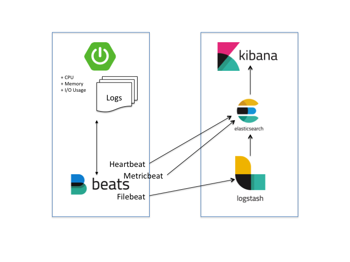
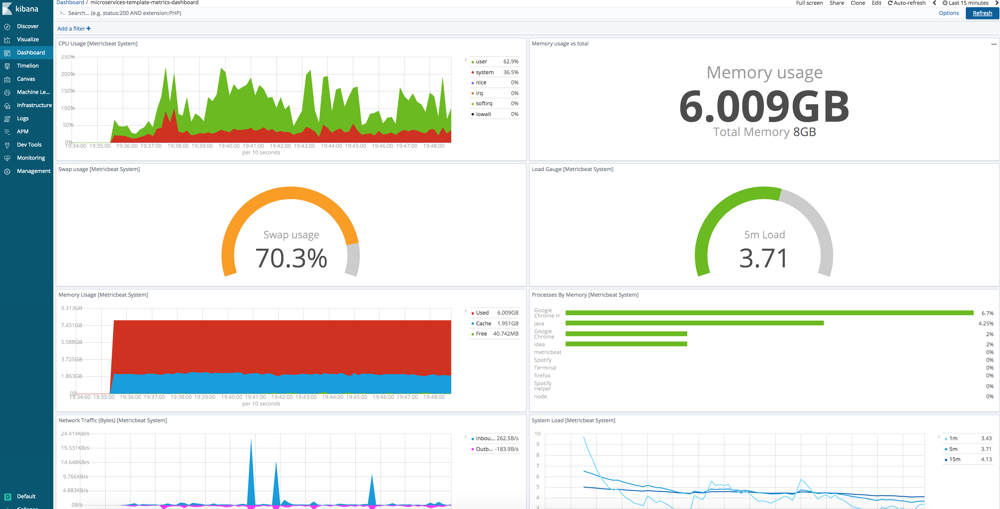
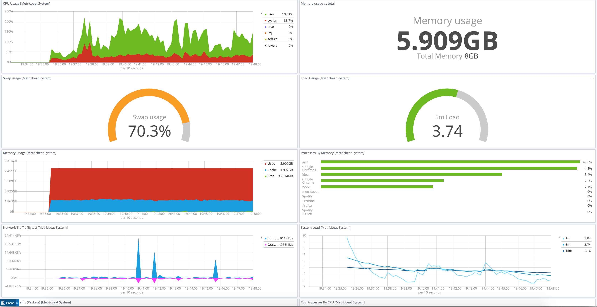
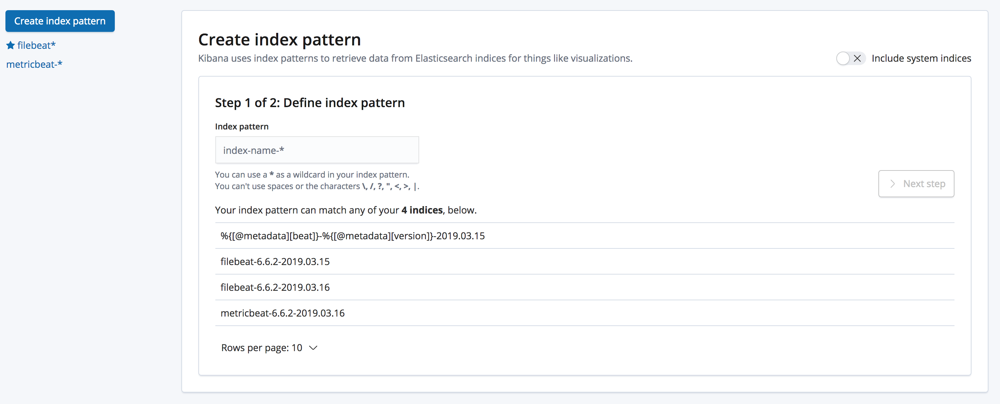
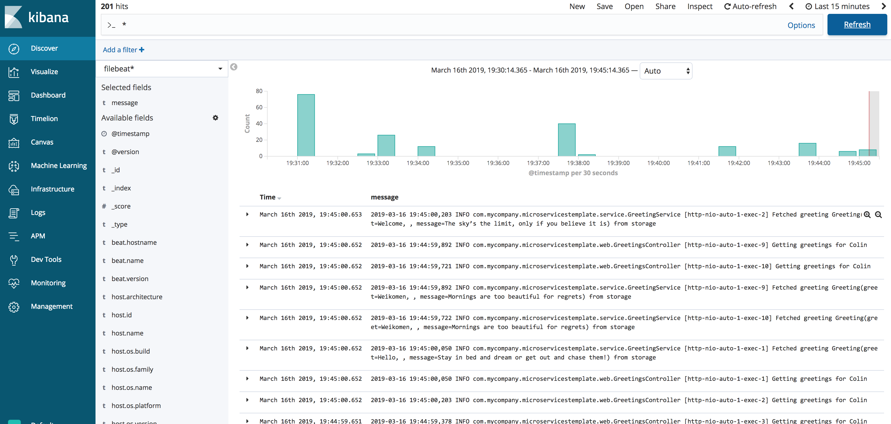
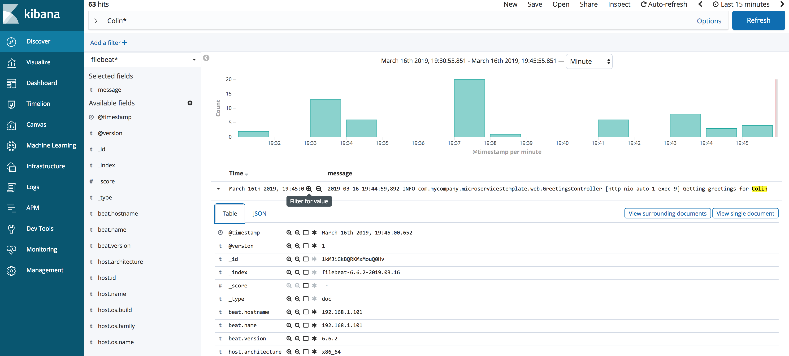
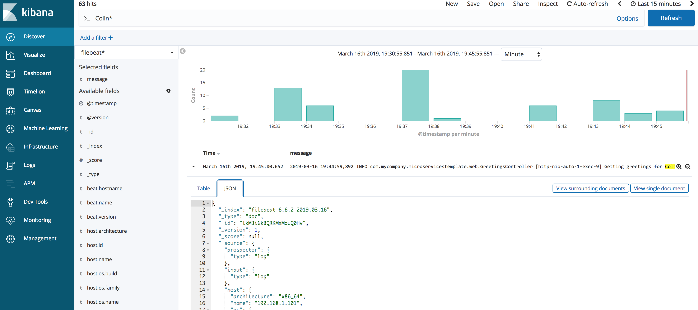
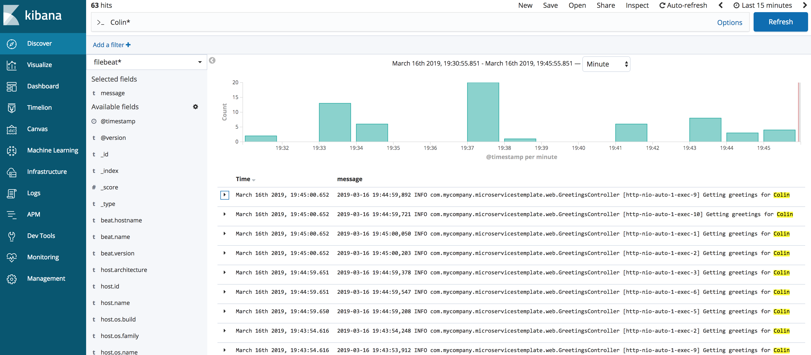

# Centralized Logging with Elastic Stack

## Table of Contents

* [Preface](#preface)
* [The Elastic Stack](#the-elastic-stack)
* [Stack Overview](#stack-overview)
* [Setup](#setup)
	* [Download](#download)
	* [ElasticSearch](#elasticsearch)
    * [Logstash](#logstash)
    * [Filebeat](#filebeat)
    * [Metricbeat](#metricbeat)
    * [Heartbeat](#heartbeat)
    * [Kibana](#kibana)
        * [Creating Index Pattern](#creating-index-pattern)
        * [Viewing logs](#viewing-logs)
        * [Searching logs](#searching-logs)
	

## <a name="preface"></a>Preface

This project of mines demonstrates how to setup and configure the Elastic Stack for a project. Note that I'm only going to showcase the most minimalistic options of configurations. 

elastic.co has in-depth tutorial & guides as part of their documentation along with reference examples shipped with each of their products to help you do the most advanced setup.

## <a name="the-elastic-stack"></a>The Elastic Stack

What is the elastic stack? 

The Elastic Stack is the new name for the list of products offered by elastic.co

Previously this was commonly known as the ELK Stack (because it ONLY contained ElasticSearch-Logstash-Kibana). But now it has outgrown that to contain more software products most noticeably Beats (which consist of many individual components), APM (Application Performance Monitoring), Elastic on the Cloud offering and a few more. 

The rationale behind calling it the Elastic Stack is simply because their stack has now many products and not just ElasticSearch, Logstash, and Kibana.

## <a name="stack-overview"></a>Stack Overview

Here's a brief overview of what each product of the stack does. I'm probably not going to do it justice myself or I might be a tad incorrect so please head over to elastic.co official site to get an explanation of what each product is.

| Product | Description |
|:-------------------- |:--------------- |
| Elasticsearch | A highly available Search Engine |
| Logstash | A lighweight log centalizer, transformer, and stasher |
| Kibana | A visualization tool that views the elasticsearch's data |
| Filebeat | A lightweight log shipper |
| Metricbeat | A lightweight metric data shipper |
| Heartbeat | A lightweight heartbeat pinger |

## <a name="setup"></a>Setup

As part of this demo I'm going to also use one of my other sample application as demonstration - https://github.com/colinbut/microservices-template

This is how it fits together:



### <a name="download"></a>Download 
Download all the services below from elastic.co site's download pages of each of their products.
Unpack all the services into their own distinct binary directories.

### <a name="elasticsearch"></a>1 ElasticSearch

ElasticSearch is the search engine which contains indices of data ingested from various sources and it is the core of the Elastic Stack. It is at the heart of everything. So the first thing is to start this service up.

Minimal configuration needed and so can fallback to all defaults.

```bash
/bin/elasticsearch
```

by default, ElasticSearch runs on port 9200. So mines was running on localhost therefore - http://localhost:9200

### <a name="logstash"></a>2 Logstash

Logstash is a transformation pipeline. You feed in input data and you can filter it by doing a serious of transformations on that data fed in finally outputting back to the connecting sink. In case of the Elastic Stack (and previous the ELK stack) this would be Elastic Search the search engine.

This is optional. Tradtionally this was somewhat mandatory as it was one of the main services that made up the previous ELK stack.

```bash
/bin/logstash -f logstash-conf.conf
```

Logstash default runs on port 5044.

logstash-conf.conf:

```
input {
  stdin {}
  beats {
    port => 5044
  }
}

output {
  stdout {}
  elasticsearch {
    hosts => ["http://localhost:9200"]
    index => "%{[@metadata][beat]}-%{[@metadata][version]}-%{+YYYY.MM.dd}"
  }
}
```

In above I configured stdin & stdout plugins for input & output respectively simply for as a means of sanity test to ensure Logstash is up and running and appears fine to me. 

### <a name="filebeat"></a>3 Filebeat

```bash
./filebeat
```

Filebeat is a lightweight log shipper. All it does is gather the logs from your application(s) and ships it to ELK stack. As an addition to the ELK stack, beat that made ELK stack became what is now known as Elastic Stack.

`filebeat.yml`

```yaml
- type: log
  enabled: true
  paths:
    - /Applications/dev-sandbox/projects/microservices-template/logs/microservice-template*.log
```

### <a name="metricbeat"></a>4 Metricbeat

```bash
./metricbeat
```

The following configuration setups predefined dashboards made already by Elastic on Kibana and tells Metricbeat to ship metric data onto ElasticSearch.

```yaml
setup.dashboards.enabled: true 

setup.kibana:
  host: "localhost:5601"

#-------------------------- Elasticsearch output ------------------------------
output.elasticsearch:
  hosts: ["localhost:9200"]
```

Metricbeat needs to be run on the same host as the application that it monitors for metrics. If application is containerized (Docker) then Metricbeat can also gather metrics from within the Docker container and you can then view the metrics data on the predefined Kibana dashboards.



__Full Screen View__


### <a name="heartbeat"></a>5 Heartbeat

```bash
./heartbeat
```

The most important configuration is to tell Heartbeat where to monitor for health and where to send the gathered data to.
Again, just like other beats, you can choose to send to either ElasticSearch directly or via Logstash.

```yaml
# Configure monitors
heartbeat.monitors:
- type: http
  # List or urls to query
  urls: ["http://localhost:54268"]
  # Configure task schedule
  schedule: '@every 10s'
  # Total test connection and data exchange timeout
  #timeout: 16s

#-------------------------- Elasticsearch output ------------------------------
output.elasticsearch:
  hosts: ["localhost:9200"]
```

Above, i've configured it so send it to ElasticSearch directly as I don't require any transformation processing in Logstash and setup the monitor to ping my demo application's url every 10s.

Just like other beats, Heartbeat comes with predefined Kibana dashboard that can be loaded into Kibana on startup.

### <a name="kibana"></a>6 Kibana

Finally, the visualization tool of the Elastic Stack allowing you to "see" the data ingested for analysis. 

```bash
/bin/kibana
```

No special configuration required and can use defaults as everything in Kibana setup is defaulted. The ElasticSearch url needs changing if Kibana is not run on the same host as ElasticSearch is.

With Kibana you can use it as a centralized logging tool where you can see all your logs for all your applications in one place.
You can also create various dashboards of different types of graphs of your log data.

#### <a name="creating-index-pattern"></a>Creating index pattern

To view logs or any other data you require to configure on the Kibana UI to tell it what ElasticSearch Indices to look for.
All data is stored in ElasticSearch as a series of indices with data.



#### <a name="viewing-logs"></a>Viewing logs



__Inspecting the table view__


__Looking at the JSON view__


#### <a name="searching-logs"></a>Searching logs


